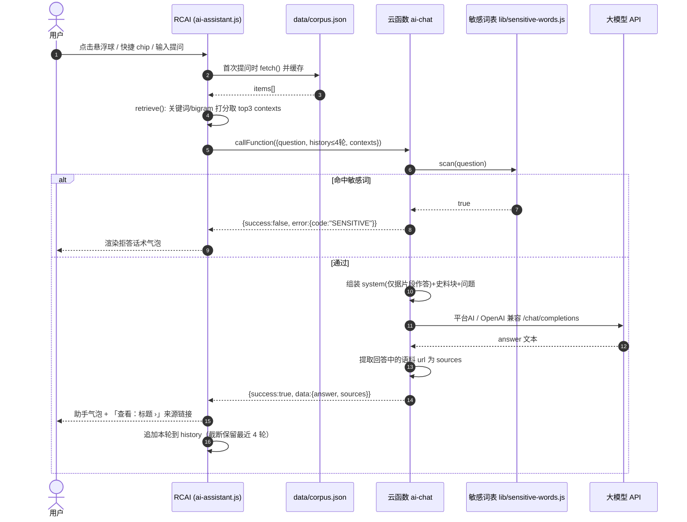
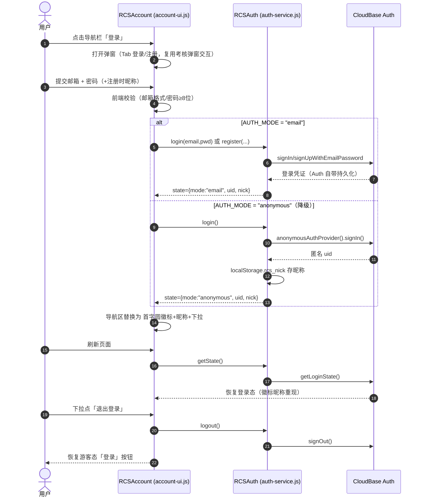
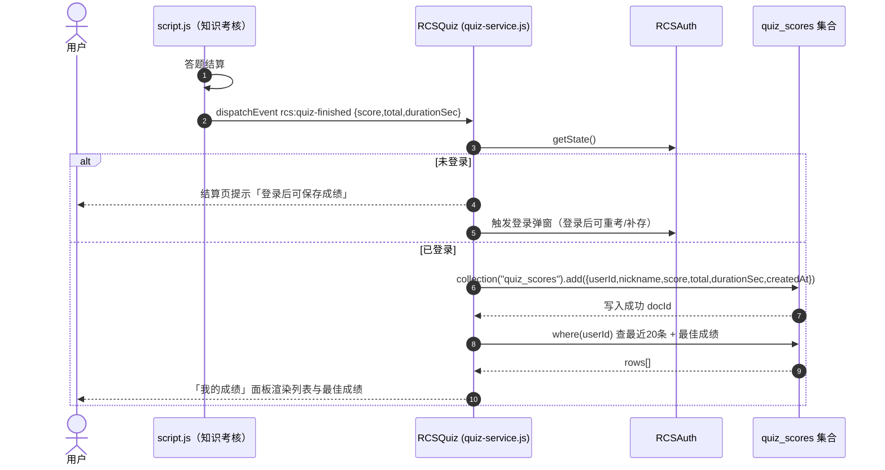

# 红色文化传播网 · 增量架构设计与任务分解（v2）

> 输入：`docs/prd-incremental.md`（增量 PRD v2）+ 现有站点代码结构。
> 决策基线（主理人已确认）：Q1 CloudBase Auth 邮箱密码优先 / 匿名降级演示版；Q2 云函数封装大模型（平台 AI 优先，OpenAI 兼容兜底）；Q3 敏感词拦截为 P0 内置；Q4 数据扩充采用 PRD P1-2 清单；Q5 联系页纯前端 + mailto；Q6 新增 `generate-event-pages.mjs`。
> 云环境：`cloud1-d0g0aq0bl2cfbcbdf`（Node.js 云函数 + NoSQL 已开通）。技术形态：**纯静态原生 HTML/CSS/JS，零构建工具**，云能力经 CDN 引入 `@cloudbase/js-sdk`。

---

## 1. 实现方案

### 1.1 核心难点与技术选型

| 难点 | 方案 |
|---|---|
| 无构建工具下接入云能力 | `<script>` CDN 引入 `@cloudbase/js-sdk`，封装 **初始化单例** `cloudbase-config.js`，全局暴露 `window.RCS.app`，避免多页面重复 init 和竞态 |
| 双认证模式兼容 | `auth-service.js` 统一门面：内部按 `RCS.config.authMode`（`email` / `anonymous`）分流；对外只暴露 `register/login/logout/getState/onAuthChange`，UI 层零感知模式差异。邮箱密码优先，控制台未开通邮箱登录时把开关拨到 `anonymous`（匿名建号 + `localStorage.rcs_nick` 暂存昵称），后续可在同一账号上升级绑定邮箱 |
| AI 回答"只依据站内史料、不编造" | **前端轻量检索 + 云函数受限生成** 两段式：① 前端懒加载 `data/corpus.json`（14 英雄 + 12 地点 + 11 事件的结构化语料），对问题做关键词/别名词频打分，召回 top3 片段；② 云函数 `ai-chat` 收到 `{question, history, contexts}` 后先过敏感词，再把"系统提示词（限定仅依据片段作答）+ 片段 + 问题"交给大模型。contexts 为空或模型无法依据片段作答时输出统一兜底话术"该内容暂未收录…" |
| 密钥安全 | 密钥只存云函数环境变量（`OPENAI_API_KEY` / `OPENAI_BASE_URL` / `OPENAI_MODEL`），前端与语料文件中零密钥 |
| 内容安全（P0 内置） | 云函数侧两级拦截：命中敏感词直接返回拒答话术（不走大模型，省成本且确定性强）；系统提示词再约束"涉政评价类问题一律引导浏览栏目"。前端不做过滤（不可信任客户端） |
| 详情页规模化生产 | 完全沿用现有工作流：新增 `scripts/generate-event-pages.mjs`（复刻 `generate-place-pages.mjs` 的 `nav()/footer()/page()` 模板函数结构），数据内联数组驱动，`node` 一键产出 7 个事件页 |

### 1.2 架构模式

- 前端：**多页应用（MPA）+ 模块化单例脚本**。每个功能一个全局命名空间对象（`RCS` / `RCSAuth` / `RCSAccount` / `RCSQuiz` / `RCAI`），按需在各页面 `<script>` 引入，无打包器。
- 后端：**BaaS + 单一云函数**。Auth 用 CloudBase Auth；成绩用 NoSQL 集合 `quiz_scores`；唯一云函数 `ai-chat` 承担大模型代理与安全审查。
- 检索：**内存关键词倒排（简化版 BM25 思想）**——语料 ≤40 条，无需向量库/搜索引擎，前端 200 行以内可实现。

### 1.3 AI 助手交互链路（详细）

```
用户提问 ──► ai-assistant.js（首次懒加载 data/corpus.json 并缓存）
        ──► retrieve(question)：对每个 item 用 name/aliases/keywords 命中数 + 正文 bigram 命中数打分，取 top3
        ──► tcb.callFunction({ name:'ai-chat', data:{ question, history[≤4轮], contexts[top3] } })
                │
                ▼
        ai-chat/index.js
          1) 参数校验（question 非空、长度 ≤500、contexts ≤3）
          2) 敏感词扫描 → 命中：直接返回拒答话术，code=SENSITIVE
          3) 组装 messages：
             system = 固定提示词（角色设定 + 仅依据<史料>片段回答 + 未收录话术 + 来源行格式）
             user   = <史料>片段块（title/url/text）/n</史料>/n + 用户问题
             + history 最近 4 轮（支持 P2 多轮追问的预留位）
          4) 调模型：优先平台 AI 能力 → 失败/未配置则 POST OpenAI 兼容 /chat/completions（原生 https，不加依赖）
          5) 从回答中提取出现的语料 url 作为 sources 回传
                │
                ▼
        { success:true, data:{ answer, sources:[{title,url}] } }
        ──► 前端渲染气泡：答案正文 + 「查看：标题 ›」text-link；失败/超时(15s)渲染友好错误
```

### 1.4 Auth 方案

- **email 模式（默认）**：`auth.signUpWithEmailAndPassword` 注册（附昵称存 `localStorage.rcs_nick` 及后续可扩展的用户档案集合）、`signInWithEmailAndPassword` 登录；Auth 自带持久化，刷新保活。
- **anonymous 模式（降级）**：首次进入静默 `anonymousAuthProvider().signIn()` 自动建号；昵称存 `localStorage`；提供"升级正式账号"入口（同 uid 绑定邮箱密码）。
- `auth-service.onAuthChange(cb)` 驱动导航栏用户区渲染：游客显示「登录」按钮 → 弹窗（Tab 登录/注册，复用考核弹窗遮罩+动画模式）；登录态显示首字圆徽标 + 昵称下拉（我的成绩 / 退出登录）。

### 1.5 成绩存储方案

- 考核完成后 `script.js` 派发 `CustomEvent('rcs:quiz-finished', {detail:{score,total,durationSec}})`（考核逻辑不动刀，只加一行派发，保持解耦）。
- `quiz-service.js` 监听：未登录 → 提示并唤起登录弹窗（登录后本次成绩仍可手动补存）；已登录 → `db.collection('quiz_scores').add({...})` 落库。
- 「我的成绩」面板（挂在用户下拉菜单）：查本 userId 最近 20 条 + 最佳成绩。集合安全规则设为"仅创建者可读写"。

---

## 2. 文件列表及相对路径

### 2.1 新增文件

| 相对路径 | 用途 |
|---|---|
| `cloudbase-config.js` | js-sdk CDN 加载后的初始化单例：`window.RCS = {ENV, AUTH_MODE, app}`，提供 `RCS.getApp()` 幂等获取实例；含 `authMode` 配置开关（email/anonymous） |
| `auth-service.js` | 认证门面：register/login/logout/getState/onAuthChange，双模式分流，匿名昵称 localStorage 兜底；全局 `window.RCSAuth` |
| `account-ui.js` | 登录/注册弹窗（Tab 切换、表单校验、错误提示）、导航栏用户区（登录按钮 ↔ 徽标+昵称下拉）、「我的成绩」面板渲染；全局 `window.RCSAccount` |
| `quiz-service.js` | 监听 `rcs:quiz-finished`，成绩写入 `quiz_scores`、查询最近/最佳成绩；全局 `window.RCSQuiz` |
| `ai-assistant.js` | 右下角悬浮球 + 聊天面板 DOM 注入、欢迎语与 3 个快捷 chips、corpus 懒加载与关键词检索、调用云函数、气泡渲染（助手左灰/用户右红）、Enter 发送、移动端底部抽屉；全局 `window.RCAI` |
| `ai-assistant.css` | 浮窗全部样式（桌面 360×520 卡片阴影 / 移动端抽屉 / chips / 气泡 / 打字中动效） |
| `data/corpus.json` | AI 语料库（schema 见 §3.1）：heroes×14 + places×12 + events×11 全量条目 |
| `cloudfunctions/ai-chat/index.js` | 云函数入口：参数校验 → 敏感词拦截 → 提示词组装 → 平台 AI / OpenAI 兼容调用 → sources 提取 |
| `cloudfunctions/ai-chat/package.json` | 云函数依赖声明（见 §6） |
| `cloudfunctions/ai-chat/lib/prompt.js` | 系统提示词常量与 messages 组装函数（独立成文件便于调优审查） |
| `cloudfunctions/ai-chat/lib/sensitive-words.js` | 敏感词表 + 匹配函数（涉政攻击性词汇、闲聊诱导类），P0 安全内置 |
| `scripts/generate-event-pages.mjs` | 事件详情页生成器（复刻 place 生成器模板结构），产出下列 7 页 |
| `event-yida.html` | 中共一大详情页（脚本产出） |
| `event-nanchang.html` | 南昌起义详情页（脚本产出） |
| `event-jinggangshan-huish.html` | 井冈山会师详情页（脚本产出） |
| `event-zunyi.html` | 遵义会议详情页（脚本产出） |
| `event-changzheng.html` | 长征（含飞夺泸定桥）详情页（脚本产出） |
| `event-kangzhan.html` | 抗日战争胜利详情页（脚本产出） |
| `event-kaiquo.html` | 开国大典详情页（脚本产出） |
| `about.html` | 关于本站 / 史料来源说明页 |
| `contact.html` | 联系我们：说明文案 + 表单（前端校验）+ mailto 提交 |
| `faq.html` | 常见问题 ≥8 条（覆盖内容是否免费、AI 可信度、成绩保存、隐私等） |

### 2.2 修改的现有文件

| 相对路径 | 修改内容 |
|---|---|
| `index.html` | ① 页脚三个 `#` 链接改为 `about.html`/`contact.html`/`faq.html`；② 引入 `cloudbase-config.js`、`auth-service.js`、`account-ui.js`、`quiz-service.js`、`ai-assistant.js/css`；③ 导航栏右侧预留 `#user-area` 挂载点；④ 三主题卡片数量文案随扩充同步（14 位英雄 / 12 处地点） |
| `events.html` | ① 时间轴 6 个 `.vt-item` 的 `.vt-title` 包 `<a>` 链到对应 `event-*.html`；② 按年代补 4 条目：1919 五四运动、1927 秋收起义、1935 瓦窑堡会议、1937 全面抗战爆发（列表展示级，不建详情页）；③ 页脚 `#` 替换；④ 引入公共脚本 |
| `heroes.html` | 列表追加恽代英/瞿秋白/左权/彭雪枫/张思德/黄继光 6 张卡片；页脚 `#` 替换；引入公共脚本 |
| `places.html` | 列表追加上海一大会址/瑞金/古田/瓦窑堡/重庆红岩村/抗美援朝纪念馆 6 张卡片；页脚 `#` 替换；引入公共脚本 |
| `script.js` | 考核结算处派发 `rcs:quiz-finished` CustomEvent（一行解耦改动），其余逻辑不动 |
| `style.css` | 文件末尾追加：登录弹窗（复用 `.quiz-modal` 模式）、用户徽标/下拉菜单、我的成绩面板、FAQ/about 页排版所需少量通用类 |
| `scripts/generate-hero-pages.mjs` | ① 数据数组追加 6 位新英雄（slug：yun-daiying/qiu-qiubai/zuo-quan/peng-xuefeng/zhang-side/huang-jiguang）；② `footer()` 模板中 `#` 链接替换为真实路径（重新运行即刷新全部 14 个 hero 页页脚） |
| `scripts/generate-place-pages.mjs` | ① 数据数组追加 6 个新地点（slug：shanghai-yida/rujin/gutian/wayaobao/chongqing-hongyan/kangmei-jinianguan）；② `footer()` 模板同上修复（重跑刷新全部 12 个 place 页） |
| （其余 13 个既有 hero/place 详情页） | 不手工改：由更新后的生成脚本重跑自动获得新页脚与互链 |

---

## 3. 数据结构和接口

### 3.1 `data/corpus.json` Schema

```jsonc
{
  "version": "1.0",
  "updatedAt": "2026-08-24T00:00:00.000Z",
  "items": [
    {
      "id": "hero-yangjingyu",            // {type}-{slug}，与详情页文件名 slug 一致
      "type": "hero",                     // "hero" | "place" | "event"
      "name": "杨靖宇",
      "aliases": ["马尚德"],               // 曾用名/别称，参与检索
      "keywords": ["抗联", "东北抗日联军", "濛江", "靖宇县"],
      "url": "hero-yangjingyu.html",      // 来源页相对路径，直接作为答案引用链接
      "summary": "东北抗日联军第一路军总司令，1940 年 2 月在吉林濛江壮烈牺牲。",
      "text": "生平事迹全文拼接纯文本（取自详情页各 story 段落，约 300—600 字）…"
    }
    // …共约 37 条：hero×14、place×12、event×11（含五四运动等 4 个无详情页条目，
    //   这 4 条 url 指向 events.html#anchor）
  ]
}
```

检索打分规则（前端实现，写入共享知识供工程师遵循）：`score = name精确命中×5 + aliases命中×4 + keywords命中×3 + text中bigram共现次数×1`，取 top3 且 score>0，否则 contexts 为空。

### 3.2 云函数 `ai-chat` 请求/响应 JSON

请求（`tcb.callFunction({name:'ai-chat', data})`）：

```jsonc
{
  "question": "杨靖宇是在哪里牺牲的？",       // 必填，1—500 字
  "history": [                              // 可选，最多 4 轮（8 条消息），支持追问
    {"role": "user", "content": "讲讲赵一曼"},
    {"role": "assistant", "content": "赵一曼是……"}
  ],
  "contexts": [                             // 前端检索结果，最多 3 条
    {"id": "hero-yangjingyu", "title": "杨靖宇", "url": "hero-yangjingyu.html",
     "text": "……1940 年 2 月在吉林濛江（今靖宇县）牺牲……"}
  ]
}
```

响应（统一信封，全项目约定）：

```jsonc
// 成功
{
  "success": true,
  "data": {
    "answer": "杨靖宇将军于 1940 年 2 月 23 日在吉林濛江（今靖宇县）保安村三道崴子壮烈牺牲。\n查看：杨靖宇 ›",
    "sources": [{"title": "杨靖宇", "url": "hero-yangjingyu.html"}]
  },
  "error": null
}

// 拒答 / 异常（HTTP 层仍为 200，靠信封判断）
{
  "success": false,
  "data": null,
  "error": { "code": "SENSITIVE", "message": "该内容暂未收录，建议浏览本站的英雄人物、红色地点与历史事件栏目。" }
}
```

error code 枚举：`INVALID_PARAM` / `SENSITIVE`（敏感词拦截）/ `NO_CONTEXT`（未收录兜底话术）/ `UPSTREAM_ERROR`（模型调用失败）/ `TIMEOUT`。前端对 `SENSITIVE/NO_CONTEXT` 直接展示 message；对 `UPSTREAM_ERROR/TIMEOUT` 显示"助手开小差了，请稍后再试"。

### 3.3 `quiz_scores` 集合文档结构

```jsonc
{
  "_id": "自动生成",
  "userId": "auth 用户 uid（CloudBase Auth USER_ID）",
  "nickname": "星星之火",                    // 提交时从 localStorage.rcs_nick 快照
  "score": 4,                               // 得分（整数）
  "total": 5,                               // 总题数
  "durationSec": 96,                        // 用时（秒），可选
  "createdAt": "2026-08-24T12:00:00.000Z"   // ISO 8601 UTC（全项目日期统一格式）
}
```

- 查询模式：`where({userId}).orderBy('createdAt','desc').limit(20)` 取最近记录；`orderBy('score','desc').limit(1)` 取最佳。
- 安全规则：仅创建者（`userId == auth.uid`）可读可写。
- 索引：`(userId, createdAt desc)` 组合索引。

---

## 4. Mermaid 时序图

### (a) AI 问答



### (b) 注册 / 登录 / 退出



### (c) 成绩保存



---

## 5. 任务分解

> 共 11 个任务（符合 8–14 条要求）。T02–T05、T07–T09 相互独立可并行，仅依赖 T01 或无依赖，避免长线性链。

### T01 云接入与认证基座
- **涉及文件**：`cloudbase-config.js`、`auth-service.js`、`account-ui.js`、`style.css`（追加弹窗/徽标/下拉样式）
- **前置依赖**：无
- **验收要点**：CDN 引入后 `RCS.getApp()` 多页面幂等单例；email 模式注册→登录→刷新保活→退出全流程可用；把 `AUTH_MODE` 拨为 `anonymous` 后匿名登录+昵称暂存同样可用；密码错误/邮箱格式有友好中文提示；弹窗动画与考核弹窗观感一致。

### T02 AI 助手前端
- **涉及文件**：`ai-assistant.js`、`ai-assistant.css`、`data/corpus.json`（初版：现有 8 英雄+7 地点+6 事件条目）、`index.html`（引入脚本 + 浮窗容器）
- **前置依赖**：T01（用其 app 单例发起 callFunction）
- **验收要点**：右下角悬浮球全站可点；首次打开出现欢迎语 + 3 个快捷 chips 且点击即发送；桌面 360×520 卡片 / 移动端底部抽屉两形态正常；检索能对"杨靖宇在哪里牺牲"召回正确片段；云函数未就绪时有优雅降级提示；连续 5 轮对话不崩。

### T03 ai-chat 云函数
- **涉及文件**：`cloudfunctions/ai-chat/index.js`、`package.json`、`lib/prompt.js`、`lib/sensitive-words.js`
- **前置依赖**：无（与 T02 并行开发，联调在 T11）
- **验收要点**：部署到 `cloud1-dog0aq0bl2cfbcbdf` 环境后真实问答返回正确答案+来源；命中敏感词直接拒答（不消耗模型调用）；contexts 为空返回未收录话术；上游失败返回 UPSTREAM_ERROR 信封；密钥仅存在于云函数环境变量，代码与日志中零泄漏；响应 ≤8s（15s 前端超时）。

### T04 事件详情页生成器与 7 个事件页
- **涉及文件**：`scripts/generate-event-pages.mjs`、产出的 `event-yida/nanchang/jinggangshan-huish/zunyi/changzheng/kangzhan/kaiquo.html` ×7
- **前置依赖**：无
- **验收要点**：`node scripts/generate-event-pages.mjs` 一键产出 7 页；每页 ≥3 区块（概述/背景/经过/意义）+ ≥2 相关人物/地点互链；上一事件/下一事件翻页闭环；page-hero 风格与 place 详情页一致；长征页含飞夺泸定桥内容并与 `place-luding.html` 互链。

### T05 占位页补齐 ×3
- **涉及文件**：`about.html`、`contact.html`、`faq.html`
- **前置依赖**：无
- **验收要点**：about 含站点定位与史料来源清单；contact 前端校验 + mailto 提交可用；FAQ ≥8 条且覆盖"内容是否免费""AI 回答可信吗""成绩保存在哪里"；三页沿用统一骨架与 CSS 类，移动端正常。

### T06 全站链接修复与公共组件挂载
- **涉及文件**：`index.html`、`events.html`、`heroes.html`、`places.html`（页脚 `#` 替换、events 时间轴标题链接化、四页引入公共脚本与 `#user-area` 挂载点）
- **前置依赖**：T01、T02、T04、T05（目标页面须存在）
- **验收要点**：全站 grep 不到 `href="#"` 死链；events 时间轴每个已有条目可点进对应详情页；任意页面均可使用 AI 浮窗与登录功能；导航「关于本站」指向 about.html。

### T07 英雄数据扩充 +6
- **涉及文件**：`scripts/generate-hero-pages.mjs`（+6 数据 + footer 模板修复）、`heroes.html`（列表加卡）、`index.html`（数字 8→14）、`data/corpus.json`（+6 hero 条目）
- **前置依赖**：T02（corpus.json 已建立）、T04（生成器模式就绪即可开工，实际可与 T04 并行）
- **验收要点**：恽代英/瞿秋白/左权/彭雪枫/张思德/黄继光 6 个详情页生成且史实表述与主流权威表述一致；heroes.html 卡片可点达；首页数字同步；重跑脚本后全部 hero 页页脚无死链；corpus 新条目可被 AI 召回。

### T08 地点数据扩充 +6
- **涉及文件**：`scripts/generate-place-pages.mjs`（+6 数据 + footer 模板修复）、`places.html`（列表加卡）、`index.html`（数字 7→12）、`data/corpus.json`（+6 place 条目）
- **前置依赖**：同 T07
- **验收要点**：上海中共一大会址/瑞金/古田/瓦窑堡/重庆红岩村/抗美援朝纪念馆 6 个详情页生成；places.html 卡片可点达；首页数字同步；corpus 新条目可被 AI 召回。

### T09 事件时间轴补条目
- **涉及文件**：`events.html`（+4 条目：1919 五四运动、1927 秋收起义、1935 瓦窑堡会议、1937 全面抗战爆发）、`data/corpus.json`（+4 event 条目，url 指向 `events.html` 锚点）
- **前置依赖**：T02、T06（events.html 已完成链接化改造）
- **验收要点**：新条目按年代正确插入时间轴且样式一致；表述与主流权威口径一致；这 4 个条目也可被 AI 助手检索回答。

### T10 成绩云端保存与「我的成绩」
- **涉及文件**：`quiz-service.js`、`script.js`（派发 `rcs:quiz-finished`）、`account-ui.js`（下拉加「我的成绩」入口 + 面板渲染）
- **前置依赖**：T01
- **验收要点**：登录后完成考核成绩落库 `quiz_scores`（字段齐全、createdAt 为 UTC ISO）；未登录提交弹出提示并可唤起登录弹窗；个人面板显示最近 20 条与最佳成绩；刷新后记录仍在；集合安全规则仅本人可读写。

### T11 语料完整化与端到端联调回归
- **涉及文件**：`data/corpus.json`（合并 T07–T09 新增条目、全文校对）、`docs/deploy-notes.md`（云函数部署与环境变量配置说明，简版）
- **前置依赖**：T03、T06、T07、T08、T09、T10
- **验收要点**：对照 P0 验收标准逐条自测通过（AI 正确答+来源链接、敏感话题拒答、连续 5 轮稳定、移动端浮窗可用、全站无死链、注册登录闭环、成绩落库）；语料 37 条全覆盖且 summary/text 与详情页一致；`deploy-notes.md` 含环境变量清单与部署步骤。

---

## 6. 云函数 package.json 依赖（最少化）

```json
{
  "name": "ai-chat",
  "version": "1.0.0",
  "main": "index.js",
  "dependencies": {
    "@cloudbase/node-sdk": "^3.7.0"
  }
}
```

- 仅 1 个依赖。模型调用使用 Node 原生 `https` 模块直连 OpenAI 兼容接口，**不引入 axios/openai SDK**；若启用平台内置 AI 能力则走云函数内置通道，同样零额外依赖。（如团队既有云函数统一用 `wx-server-sdk`，可直接替换，二选一以现有函数为准。）

---

## 7. 共享知识（给工程师的横切约定）

1. **视觉令牌**：主红一律用 CSS 变量 `var(--red)`（#C8102E），深红眉标用 `var(--red-bright)`；禁止硬编码色值。复用既有类：`kicker / h2 / sub / text-link(.lg/.sm) / module(.gray/.white/.black) / page-hero / bio-section / quote-black / stories / story / person-nav(pn-prev/pn-mid/pn-next) / quiz-modal`。新组件样式追加在 `style.css` 尾部带注释分区，浮窗样式独立于 `ai-assistant.css`。
2. **页面骨架模板约定**：`nav()` / `footer()` / STAR SVG 常量在三个生成器中各有一份模板函数——**修改页脚只需改生成器模板并重跑**，手写页仅 `index/events/heroes/places` 四个。新增生成器必须复制 `generate-place-pages.mjs` 的结构（数据数组 + IMGS 映射 + 模板函数 + forEach 产出）。
3. **生成脚本数据源约定**：数据内联在脚本顶部数组中（不引外部 JSON）；slug 即文件名；`node scripts/generate-xxx-pages.mjs` 在站点根目录执行，产出 `<type>-<slug>.html`。
4. **js-sdk 全局命名**：`window.RCS`（配置+app 单例）、`window.RCSAuth`、`window.RCSAccount`、`window.RCSQuiz`、`window.RCAI`。页面引入顺序固定：`cloudbase-config.js → auth-service.js → account-ui.js → quiz-service.js(仅首页) → ai-assistant.js`。CDN 用 `https://static.cloudbase.net/cloudbase-js-sdk/<锁定版本>/cloudbase.full.js`。
5. **接口信封**：所有云函数返回统一 `{success, data, error:{code,message}}`；前端只判断 `success`。日期一律 ISO 8601 UTC 字符串。
6. **语料 ID 规则**：`{type}-{slug}` 与详情页文件名严格对应，`url` 字段即相对路径，AI 答案来源链接直接渲染为 `text-link`。
7. **安全红线**：密钥只进云函数环境变量；敏感词表只放云函数侧；前端校验仅为体验优化，一切以服务端校验为准。

---

## 8. 待明确事项

**无。** 六项决策（Q1/Q2/Q3/Q4/Q5/Q6）均已由主理人确认并落入本设计。两点实现备注（非待决）：① 若 CloudBase 平台 AI 能力在当前环境不可用，自动切换 OpenAI 兼容接口，行为对前端透明；② 匿名降级模式下昵称仅存 localStorage，不上云，属演示版已知限制。
